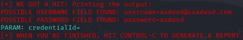

# 💻 Criação de um Phishing com o Kali Linux

## 📖 Descrição

Desafio de projeto da Digital Innovation One visando o desenvolvimento de um phishing, com fins acadêmicos, utilizando o _Kali Linux_.

## 🛠️ Ferramentas utilizadas

- `Kali Linux`
- `Oracle VirtualBox`
- `setoolkit`

## 🗂️ Configuração do phishing

1. Acesso como usuário root:

```bash
sudo su
```

2. Inicialização do `setoolkit`:

```bash
setoolkit
```

3. Tipo de ataque: `Social-Engineering Attacks`
4. Vetor do ataque: `Webbite Attack Vectors`
5. Módulo de ataque: `Credential Harvester Attack Method`
6. Método de ataque: `Site Cloner`
7. A página de login da [DIO](https://www.dio.me/) foi utilizada para a clonagem
8. Obtém o endereço da máquina (Linux):

```bash
ifconfig
```

9. O IP pode ser acessado pela vítima, os dados inseridos nos campos serão mostrados no terminal.

## 📝 Resultado


